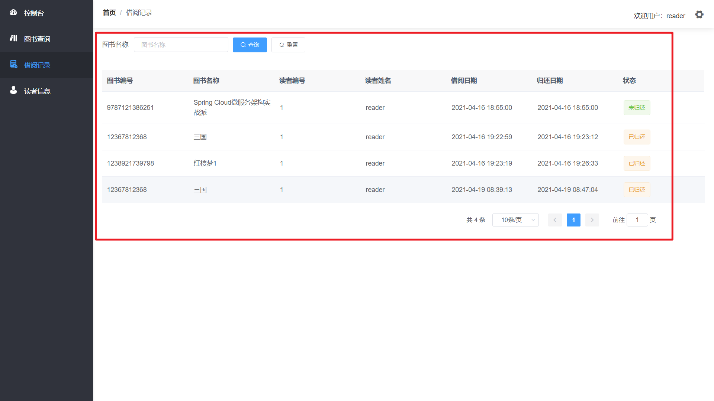

# 图书馆系统（library-system）


## 本地快捷预览项目

第一步：运行 library-run 文件夹下的`library.sql`，创建`library`数据库，
>  **注：本地的用户名和密码必须都为：`root`，端口号：`3306`** 

第二步：双击 library-run 文件夹下的`start.cmd`，弹出的dos窗口不要关闭

第三步：浏览器访问`localhost:8080`，测试账号在下面


## 主要技术

SpringBoot、Mybatis-Plus、MySQL5.7、Vue2、ElementUI等


## 主要功能

管理员模块：登录、用户管理、读者管理、借阅记录管理

读者模块：登录、查询图书信息、借阅和归还图书、查看个人借阅记录、编辑个人信息


## 主要功能截图

### 登录

登录支持两种用户角色：管理员和读者

测试账号和密码如下：

| 角色   | 测试账号 | 测试密码 |
| ------ | -------- | :------: |
| 管理员 | admin    |  admin   |
| 读者   | reader   |  reader  |


### 管理员登录

#### 管理员首页


#### 图书管理

1. 图书表格列表

   

2. 添加图书

   

3. 编辑图书

   

4. 删除图书

   


#### 读者管理

- 读者管理的增删查改类似图书管理，不再赘述

  

- 重置密码

  

#### 借阅管理

- 借阅记录查询

  

- 借阅记录编辑

  

  

### 读者登录

#### 读者首页


#### 图书查询


#### 借阅图书


#### 归还图书


#### 借阅记录



#### 读者信息

- 编辑个人信息

  

- 修改密码

  点击修改密码按钮，修改密码

  


## 代码结构

### 前端

```shell
library-ui
├─api			// api接口
├─assets		// 资源文件	
│  ├─icon	 	// 图标
│  ├─img	 	// 图片
│  └─styles	 	// 样式
├─components	// 自定义Vue组件
├─layout		// 页面布局
├─router		// Vue路由
├─utils			// 工具函数
└─views			// 页面
```


### 后端

maven项目结构

```shell
library-serve
├─java
│  └─com
│      └─admin
│          └─library
│              ├─common			// 通用类
│              │  ├─base		// 基础类
│              │  └─config		// 配置类
│              ├─controller		// 控制层
│              ├─domain			// 实体类
│              ├─mapper			// 持久层
│              └─service		// 业务层
└─resources	// maven资源配置
```


## 数据库

**使用Navicat生成ER模型图**

